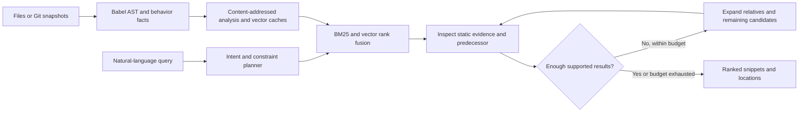

# PALIMPSEST

**Find the exact code version where behavior changed—even when the difference is a single `await`.**

Agentic Code Intelligence prototype for Samsung PRISM. PALIMPSEST ranks JavaScript snippets using lexical/vector retrieval, parser-derived behavior facts, and historical contrasts. Output is code, file/line locations, version identity, and structured evidence.

```javascript
// v1: wait for the permission operation
await checkPermission();
openSettings('bluetooth');

// v2: invocation no longer waits directly
checkPermission();
openSettings('bluetooth');
```

Query: **“Where did Bluetooth settings stop waiting for permission checking?”**

PALIMPSEST retrieves `openBluetooth@v2`, identifies the removed `await`, and lets you compare its predecessor. An unawaited invocation is a static pattern, not proof of a runtime race.

## Run locally

Requires Node.js 22.22.2+ on the Node 22 release line, Node 24.15+, or Node 26+ (matching the UI test dependency's supported runtimes). Git is needed only for repository-history indexing. No GPU, API key, or Python is required for the application.

```sh
npm ci --omit=optional
npm test
npm start
```

Open **http://127.0.0.1:3000**. The server loads three controlled demo versions automatically. The light workspace includes animated version layers, syntax-highlighted code, measured search statistics, and predecessor comparisons. Hover, focus, or tap help controls to explain the interface in the side panel. Version and lens changes rerun the search automatically; Ctrl+Enter submits the query. Pause motion with the header control; system reduced-motion preferences are respected. On Windows PowerShell, use `npm.cmd` if execution policy blocks `npm.ps1`.

CLI:

```sh
npm run demo
npm run search -- --query "Where did Bluetooth settings stop waiting for permission checking?" --top-k 3
npm run search -- --query "Find calls validateInput before executeTool"
npm run search -- --query "Find the version with removed guard for device supported"
```

## Index your own repository

```sh
# Working directory snapshot; only JavaScript/JSX is indexed
npm run index -- --repo /path/to/repo --version working

# Historical snapshots, ordered oldest to newest; no checkout or code execution
npm run index -- --repo /path/to/repo --refs COMMIT_OLD,COMMIT_NEW --out .palimpsest/history.json
npm run search -- --out .palimpsest/history.json --version COMMIT_NEW --query "calls validateInput before executeTool"
```

Re-running an existing version replaces that snapshot. Deleted files disappear from active results; unchanged file analyses and snippet vectors are reused. History follows **insertion order**, so supply chronological refs. Use a fresh index when changing embedding modes.

To browse an existing index, set `PALIMPSEST_INDEX` to its path before `npm start`. Example in PowerShell:

```powershell
$env:PALIMPSEST_INDEX = '.palimpsest/history.json'
npm.cmd start
```

The server binds to localhost by default. `PORT` changes the port and `HOST` changes the bind address. The API provides `GET /api/status` and `POST /api/search`, with `{ "query": "...", "version": "optional", "topK": 5, "mode": "palimpsest" }`.

## What makes the approach distinctive

- **Behavior-sensitive retrieval:** guards, invocation order, and direct `await` relationships distinguish near-identical snippets.
- **Historical counterexamples:** a match includes its predecessor's code and tracked changes, making wrong-version matches inspectable.
- **Evidence boundaries:** complex control flow, dynamic dispatch, optional calls, deferred awaits, and awaited promise combinators are not promoted to unsupported execution claims.
- **Incremental snapshots:** caches reuse analyses and vectors while preserving version-specific source locations.
- **A bounded retrieval agent:** observed evidence determines whether to stop, expand version relatives, or inspect more candidates. The trace records those decisions.

The current planner is a deterministic natural-language policy with supported patterns. It does **not** use an LLM, and does not understand arbitrary English or perform code generation. Its bounded search/inspect/refine policy keeps inference local and reproducible.

## Architecture



The index stores original code, an identifier-normalized AST view, behavior facts, and version lineage. Normalization preserves member names, literals, operators, negation, and `await`; it is retained for inspection/future representation experiments. Current vector ranking uses original code plus behavior text, not the normalized AST view. Retrieval combines BM25 and vector ranks via reciprocal rank fusion, then applies constraint support/contradiction signals.

## Optional learned CPU embeddings

The default `features` mode uses deterministic normalized feature-hash vectors. **These are not trained semantic embeddings.** This mode is a reproducible offline baseline; the niche improvements come from structural and version evidence.

For learned embeddings:

```sh
npm ci --include=optional
npm run demo -- --embedding minilm --out .palimpsest/minilm.json
npm run search -- --out .palimpsest/minilm.json --query "permission checking before opening settings"
```

`minilm` uses quantized `Xenova/all-MiniLM-L6-v2` through Transformers.js on CPU. The first call downloads public model files into `.cache/models`; later calls reuse them. Set `PALIMPSEST_MODEL_CACHE` to change that directory. This is a general text embedding model, not a specialized code model. Do not compare results from different embedding modes without reporting the mode.

## Evaluate

```sh
npm run check
npm test
npm run test:coverage
npm run evaluate
```

The challenge harness compares lexical, hybrid, and PALIMPSEST retrieval with 1,000 distractors. It writes query-level NDCG@10, MRR, precision, recall, correct-version top-1, latency, indexing statistics, and RSS to `evaluation-results/challenge.json`. Set `DISTRACTORS` or `EVAL_OUT` to change the corpus size/output.

**This is a synthetic development challenge; queries overlap demo cases. It is not CoIR and does not establish generalization.** See [measured results and limitations](docs/validation.md).

Tests cover exact source locations, near-identical versions, reversed order, mutually exclusive branches, loops, early returns, exception paths, nested callbacks, promise handling, deletion/reindexing, real Git snapshots, the encoder bridge, ranking metrics, request validation, and HTTP assets/search. UI interaction tests execute the trusted application in jsdom with real retrieval results, checking hover/focus/tap help, filters, predecessor expansion, motion preferences, safe code rendering, and stale-request handling. GitHub Actions verifies the core and UI interactions on Linux and Windows.

## Official AppsRetrieval screening

The project includes an **encoder-compatible baseline** following the organizer's current MTEB interface:

```sh
python -m venv .venv
# Activate .venv for your platform
python -m pip install -r requirements-eval.txt
python scripts/evaluate_mteb.py --smoke
python scripts/evaluate_mteb.py --mode features
# With optional npm dependencies installed:
python scripts/evaluate_mteb.py --mode minilm
```

The encoder independently preprocesses each input; unparseable/non-JavaScript text uses a lexical fallback. `--raw` disables behavior enrichment for an ablation. Official evaluation writes MTEB's task-result JSON to `evaluation-results/appsretrieval_results.json`.

**The official full test split has not been evaluated in this initial implementation. No official NDCG/MRR score or shortlist readiness is claimed.** The encoder adapter does not exercise query-dependent historical reranking; test that feature separately. Confirm the organizers' accepted evaluation integration before submitting a custom retriever. Keep test labels out of tuning, use development data, and preserve original corpus IDs.

## Docker

```sh
docker build -t palimpsest .
docker run --rm -p 127.0.0.1:3000:3000 palimpsest
```

The image uses the offline CPU demo. Python evaluation and learned-model downloads are separate. Docker execution was not verified in the initial environment.

## Current limits and next work

- Intrafunction static syntax evidence; no cross-file control-flow proof or runtime execution analysis.
- Function lineage is a same-file/name/ordinal heuristic. Renames, moves, duplicate symbols, and large refactors require stronger alignment.
- Duplicate callees do not receive inferred await-change certificates because call identity is ambiguous.
- Guard evidence tracks condition presence/removal, not full dominance, logical equivalence, or security guarantees.
- Vector search is an exact CPU scan and BM25 statistics are built per query. Production-scale ANN indexing and persistent lexical postings are future work.
- Caches retain obsolete entries; garbage collection and transactional/concurrent indexing are future work.
- No universal originality claim. The contribution is the specific integration and measurable behavior/version discrimination.

Next priorities: official screening baseline, held-out real repository queries, persistent search indexes, robust symbol lineage, import-aware call navigation, and optional small-model query planning.

See [architecture](docs/architecture.md), [five-minute demo script](docs/demo-script.md), [submission checklist](docs/submission-checklist.md), and [AI usage record](docs/ai-usage.md).
