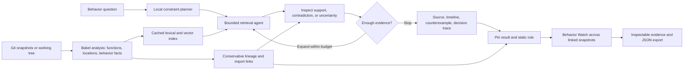

# CodeStrata

**Find the function version where behavior changed, then turn that finding into a repeatable check.**

CodeStrata is a CPU-first code intelligence workspace for JavaScript and JSX repositories. It searches code across indexed versions, inspects the source behind each result, and shows evidence for changes such as a removed direct `await`, a changed call order, or a guard that disappeared. It can follow a function through some renames and file moves while keeping ambiguous links explicitly unresolved.

**Theme:** 01 - Agentic Code Intelligence. **Team:** CodeStrata, Vellore Institute of Technology (VIT University). **Contributors:** Advay Vivek (24BCT0136, [email](mailto:advay.vivek2024@vitstudent.ac.in)) and Kaavish Gogia (24BCT0103, [email](mailto:kaavish.gogia2024@vitstudent.ac.in)).

**Submission files:** [18-slide PowerPoint](submission-documents/VITUniversity_CodeStrata.pptx), [PDF](submission-documents/VITUniversity_CodeStrata.pdf), and [completed AI disclosure](submission-documents/CodeStrata-AI-Disclosure.docx). The demo video is being recorded; its YouTube or Drive link will be added here when available. The evaluated code and result artifacts are in this repository. The final submission tag is `PRISM_GENAI_HACKATHON_Y2026`.

## The problem

A code search can find a familiar name in the wrong version. After a refactor, the same behavior may live under a new name or path, and two nearly identical functions may differ by a single `await`. A ranked snippet alone does not tell a developer where the behavior changed or whether a nearby version contradicts the answer.

## How CodeStrata solves it

1. **Index versions of real source.** Babel extracts functions, exact file and line locations, calls, direct awaits, guards, literals, and local import relationships. Indexing reads repository code; it does not execute it.
2. **Investigate a behavior question.** A bounded local agent combines lexical and vector retrieval, parses supported structural constraints, inspects candidate evidence, and expands into related versions when needed. Its actual decisions stream into the workspace.
3. **Show the competing version.** A result can appear beside a neighboring implementation that contradicts the requested pattern. The source, line highlights, and lineage confidence stay visible. Counterexamples explain a ranked result; they do not choose or rerank it.
4. **Save a Behavior Watch.** Pin a result and a static rule. CodeStrata checks the same linked function across indexed snapshots, marks where the rule holds or breaks, and exports the source-backed report. Missing or ambiguous links stay unverified.

The combination of version-aware retrieval, explicit counterexamples, conservative refactor tracking, and saved behavior checks is the project's distinguishing workflow. It takes a developer from *“where did this change?”* to a check they can revisit after the next index update. The planner and agent are deterministic; no hosted model, GPU, or API key is required for the default workspace.

## Architecture



The index is built by the CLI. The local server exposes search, source inspection, and watch checks to the browser. The light interface has an animated version view, timeline, side explanations on hover/focus/tap, and a reduced-motion control. [Architecture details](docs/architecture.md) explain the modules and evidence boundaries.

## Try the demo

Requires Node 22.22.2+ on the 22 release line, Node 24.15+, or Node 26+. Python is **not** needed for the default app; [requirements.txt](requirements.txt) is only for reproducing the optional MTEB evaluation. No GPU, hosted model, or API key is needed for the default demo.

```sh
npm ci --omit=optional
npm test
npm start
```

`npm ci` installs the packages from the committed lockfile; `--omit=optional` keeps the first run CPU-only and offline after install. The server defaults to port 3000. If that port is occupied, set `PORT` before `npm start` (for example, `$env:PORT = '3001'` in PowerShell). The sample index is prepared automatically for the demo. For container execution, run `docker build -t codestrata .` and `docker run --rm -p 3000:3000 codestrata`, then open the same URL.

Open **http://127.0.0.1:3000** and click **Investigate the refactor**. The prepared three-version example finds `pairDevice@v2`, links it to `connectDevice@v1`, and shows that the direct `await policyCheck()` in v1 is absent in v2 and restored in v3. Click **Watch behavior**, keep the suggested rule `awaits policyCheck`, then **Save and check** to see **v1 Holds → v2 Broken → v3 Holds**. Open any point for exact source or export the JSON report. On PowerShell, use `npm.cmd` if the execution policy blocks `npm.ps1`.

The example contains 25 synthetic snippets and is designed to expose a specific behavior change. “Broken” means the saved static rule is contradicted in that snapshot; it does not claim a runtime failure.

### Five-minute judge walkthrough

1. Open the light workspace and click **Investigate the refactor**. Ask where pairing stopped awaiting `policyCheck`.
2. Open `pairDevice@v2`, inspect the highlighted source, and compare its `connectDevice@v1` counterexample. The direct `await` is present in v1, absent in v2, and restored in v3.
3. Open the agent trace to show the plan, ranked retrieval, source inspection, and stop decision. Follow the imported `policyCheck` helper and the inferred rename/move link.
4. Pin `awaits policyCheck` with **Watch behavior**. Show the three linked states, open exact evidence for a point, and export the report.
5. Explain the boundary: these are static source facts, not a claim that a runtime failure occurred. Show the measured results and their scopes below.

## Use your own repository

```sh
npm run index -- --repo /path/to/repo --history 20 --out .codestrata/history.json
npm run search -- --out .codestrata/history.json --query "Where did pairing stop waiting for policyCheck?" --top-k 3
```

Start the browser with `CODESTRATA_INDEX=.codestrata/history.json npm start` on macOS/Linux. In PowerShell, set `$env:CODESTRATA_INDEX = '.codestrata/history.json'` and run `npm.cmd start`. Restart the server after reindexing so watches use the updated source. The default index uses offline feature hashing. Optional quantized BGE and Jina code encoders run on CPU with `npm ci --include=optional`; see [architecture](docs/architecture.md) for model details. Indexes must be built and searched with the same embedding mode.

## Evidence and limits

| Evaluation | Result | What it measures |
|---|---:|---|
| Controlled version challenge | 8/8 correct top result; NDCG@10 1.0 | Synthetic version discrimination on development examples |
| Pinned Async and Express repositories | BGE NDCG@10 0.6717 / 0.8577 | 60 source-reviewed, partly AI-assisted labels; single-snapshot retrieval |
| Full MTEB AppsRetrieval test | Jina code q8 NDCG@10 0.15711 | Independent encoder retrieval on Python tasks and solutions; no version reranking |

These evaluations test different things and should not be combined into one accuracy claim. [Validation methods and raw results](docs/validation.md) include the BGE baseline, model settings, and limitations. The current implementation has limited natural-language paraphrase matching; use callable names when possible. JavaScript/JSX is supported, while TypeScript and Python parsing are outside the app. Complex branches, repeated calls, deferred awaits, dynamic dispatch, and ambiguous refactors remain uncertain. Static evidence does not prove runtime behavior.

The [official Jina AppsRetrieval JSON](docs/results/appsretrieval_jina.json) and [BGE baseline JSON](docs/results/appsretrieval_results.json) are generated MTEB task outputs. The full test contains 3,765 Python queries and 8,765 solutions. It evaluates independent CPU encoders, not historical version reranking. Jina's 0.15711 NDCG@10 exceeds the tested BGE configuration's 0.0505; broader competitive standing is unknown. The [controlled challenge](docs/results/challenge.json) tests version discrimination but uses development queries overlapping the demo. The [real-repository artifact](docs/results/repositories.json) uses pinned Async and Express snapshots with 60 source-reviewed, partly AI-assisted labels.

## Reproduce and inspect

The default app needs Node only. For optional full encoder evaluation, use Python 3.11+ in a virtual environment and install `pip install -r requirements.txt`, then run the commands in [validation](docs/validation.md). The first optional model run downloads weights and the full CPU test takes hours. The application itself runs with the default feature-hash vectors; optional quantized BGE and Jina require `npm ci --include=optional` and matching index/search embedding modes.

The implementation separates [`src/`](src/) source analysis, indexing, retrieval, lineage, watch checks, and the local server from [`public/`](public/) presentation. It streams a real decision trace and exposes source locations, counterexamples, and uncertainties. The [architecture notes](docs/architecture.md) describe cache invalidation, request budgets, conservative links, and watch-state semantics. Evidence is generated from source syntax without executing the indexed repository.

Run `npm run check`, `npm test`, `npm run evaluate`, and `npm run test:browser` for local verification. The browser suite requires `npx playwright install chromium firefox` once. [GitHub Actions](https://github.com/AdvayV/AgenticIntelligence/actions) runs Node tests on Linux and Windows, browser checks, the encoder bridge, and Docker smoke checks.
