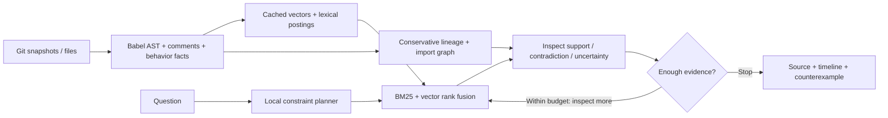

# CodeStrata

**Investigate where behavior changed across JavaScript versions, including some renamed or moved functions.**

A CPU-only code investigation workspace for Samsung PRISM Theme 01. In the prepared demo, ask **"Where did device pairing stop waiting for policyCheck?"** CodeStrata finds `pairDevice@v2`, links it to `connectDevice@v1`, shows the removed direct `await`, and opens the imported helper. Results include source, file/line locations, and version identity; supported structural questions also include inspectable evidence.

The distinctive idea is **evidence-backed evolutionary retrieval with neighboring counterexamples**: display a matching implementation beside a nearby version that contradicts the requested behavior. A bounded local agent searches, inspects static facts, follows import/version links, and streams its actual decisions. Counterexamples are checked after results are ranked; they explain a result but do not select or rerank it.

## Run locally

Requires Node 22.22.2+ on the 22 release line, Node 24.15+, or Node 26+. No GPU, API key, or Python is required for the application.

```sh
npm ci --omit=optional
npm test
npm start
```

Open **http://127.0.0.1:3000** and click **Investigate the refactor**. On PowerShell, use `npm.cmd` if execution policy blocks `npm.ps1`.

The light workspace has animated version layers, a clickable timeline, synchronized code comparisons, imported-helper navigation, and a side guide that explains controls on hover, focus, or tap. Motion can be paused and respects reduced-motion preferences. The default demo contains 25 prepared snippets across three versions; it is a controlled walkthrough, not evidence of performance on arbitrary repositories.

### Learned CPU retrieval

The default offline mode uses deterministic feature hashing, which is **not a learned semantic model**. BGE is a learned option for broader natural-language queries:

```sh
npm ci --include=optional
npm run start:semantic
```

The first run downloads quantized `Xenova/bge-small-en-v1.5` into `.cache/models`. CPU inference uses two threads by default; set `CODESTRATA_THREADS` (1 to 16) or `CODESTRATA_MODEL_CACHE` to customize. MiniLM remains available through `--embedding minilm`. BGE samples at most four overlapping source windows, including the tail; very long functions can still lose intermediate evidence in embeddings.

A separate optional code-trained encoder is available with `npm run index -- --repo /path/to/repo --version working --embedding jina --out .codestrata/code.json` and `npm run search -- --out .codestrata/code.json --query "find the changed function"`. It downloads quantized `jinaai/jina-embeddings-v2-base-code` on first use and uses 768-dimensional vectors. Its full official AppsRetrieval run with raw code reached NDCG@10 0.15711 and MRR@10 0.133675; see [validation](docs/validation.md) and the [unmodified MTEB result](docs/results/appsretrieval_jina.json). The earlier training-only selection subset scored 0.7096 and is not comparable to the full test. The index and search modes must match. Jina averages at most three source windows; unusually long files can still lose intermediate content in the embedding.

## Investigate your repository

Only JavaScript/JSX is analyzed; TypeScript and Python source are outside the application's parser. Repository code is read, never executed. Indexing is a CLI step: the browser does not upload or index a repository.

```sh
npm run index -- --repo /path/to/repo --version working

# Last 20 first-parent commits, ordered oldest to newest
npm run index -- --repo /path/to/repo --history 20 --embedding bge --out .codestrata/history.json

# Or supply chronological refs explicitly
npm run index -- --repo /path/to/repo --refs OLDER,NEWER --out .codestrata/selected.json

npm run search -- --out .codestrata/history.json --query "Where did pairing stop waiting for policyCheck?" --top-k 3
```

Use a separate index for each embedding mode. Reindexing replaces a snapshot, removes deleted files, and reuses unchanged analyses/vectors. Explicit refs follow insertion order; use a fresh index when changing chronological ordering.
The `--embedding bge` example requires the optional dependencies installed under **Learned CPU retrieval**. Omit that flag to use the offline feature-hash mode.

To browse your own indexed repository, set `CODESTRATA_INDEX` to the generated file **before starting a new server process**. For example, after the history command above, run `CODESTRATA_INDEX=.codestrata/history.json npm start` on macOS/Linux. In PowerShell, run `$env:CODESTRATA_INDEX = '.codestrata/history.json'` followed by `npm.cmd start`. Without this setting, the server opens the prepared demo. `HOST` defaults to localhost; `PORT` defaults to 3000.

| API | Purpose |
|---|---|
| GET /api/status | Index counts and capabilities |
| POST /api/search | Ranked snippets and evidence |
| POST /api/search/stream | Actual agent steps and final result as NDJSON |
| GET /api/snippet?version=...&id=... | Indexed source, history, and call links |

Search accepts `{ "query": "...", "version": "optional", "topK": 5, "mode": "codestrata" }`. Requests are bounded to 8 KB, concurrent CPU searches to two.

## Architecture



The deterministic planner supports constrained await, order, guard, and exact-literal questions. **It does not use an LLM or understand arbitrary English.** The agent is the bounded search/inspect/refine policy; trace events describe actual work. Phrase matching is limited: in the prepared demo, "Where did Bluetooth settings stop waiting for permission checking?" returns the correct `v2` with supported evidence, while replacing "permission checking" with "authorization" currently returns `v1` with uncertain evidence. Use callable names when possible and treat `uncertain` or `semantic-match` results as leads to inspect, not verified behavior changes.

Lineage uses unique same-file symbols, then conservative mutual structural matching for removed/added functions. Ambiguous copies and duplicate symbols remain unresolved. Simple local ESM import links support navigation, not cross-function execution proofs.

## Measured results

See [validation and raw artifacts](docs/validation.md) for setup and limitations.

- **Controlled version challenge:** 8 demo-related queries, 1,025 snippets. CodeStrata achieves 8/8 correct top results and NDCG@10 1.0. This is synthetic development evidence.
- **Real code:** 60 frozen, source-reviewed queries on pinned Async and Express snapshots. BGE hybrid NDCG@10 is 0.6717 and 0.8577; code-trained Jina yields 0.6500 and 0.9262 respectively. Labels are AI-assisted, not independent human judgments.
- **Official AppsRetrieval:** full MTEB CPU runs on the same test split yielded **Jina code q8 NDCG@10 0.15711, MRR@10 0.133675** and **BGE q8 NDCG@10 0.0505, MRR@10 0.043363**. Jina is the stronger submission candidate, though its competitiveness against other entrants is unknown. The test contains Python tasks and solutions, unlike the JavaScript version-investigation demo. Independent encoder evaluation does not test historical reranking.
- **Code-encoder development check:** Jina q8 scored NDCG@10 0.7096 on a 128-query, 1,000-document training-only subset. This is model-selection evidence, not an official test score.

The controlled demo demonstrates behavior/version discrimination on its prepared cases. Jina improves official independent-encoder retrieval substantially over BGE, but broad repository retrieval and the historical reranker remain separate claims. Do not compare the training-only Jina score with either official result as if they came from the same evaluation.

## Verification

```sh
npm run check
npm test
npm run evaluate
python scripts/evaluate_mteb.py --smoke  # NumPy required

# Pinned real-repository evaluation; optional npm models required
python scripts/prepare_repositories.py
node scripts/evaluate_repositories.js

# Official evaluation in an isolated Python environment
python -m venv .venv
# Activate .venv, then:
python -m pip install -r requirements-eval.txt
python scripts/compare_encoders.py
python scripts/evaluate_mteb.py --mode bge

# Reproduce code-trained selection and full official evaluation (CPU run may take hours)
python scripts/audit_apps_dataset.py
python scripts/compare_code_encoder.py
python scripts/evaluate_mteb.py --mode jina --raw --batch-size 8 --output evaluation-results/appsretrieval_jina.json

npx playwright install chromium firefox
npm run test:browser
```

GitHub Actions runs Node tests on Linux/Windows, the encoder bridge, Chromium/Firefox/mobile interactions, and a Docker HTTP smoke test. Browser reports and screenshots are uploaded as artifacts.

```sh
docker build -t codestrata .
docker run --rm -p 127.0.0.1:3000:3000 codestrata
```

The image runs the offline demo; learned-model downloads and Python evaluation are separate.

## Limits

Static syntax evidence cannot prove runtime races, security guarantees, or cross-file control flow. Complex branches, duplicate callees, deferred awaits, and dynamic dispatch remain conservative. Exact CPU scans and heuristic lineage target small repositories; monorepo throughput is unvalidated. Caches retain obsolete entries and concurrent index writers are unsupported. Public deployment needs authentication and resource isolation.

See [architecture](docs/architecture.md) and [validation](docs/validation.md) for implementation details and measured results.
